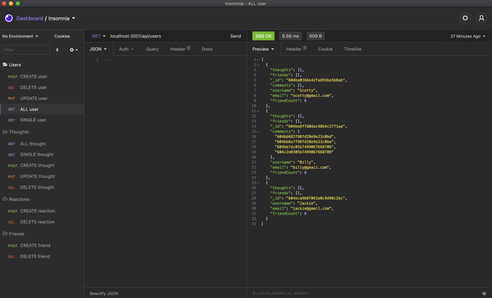

# Social-Network-API
  

## Description
This is a Social Network API application built with Express.js, MongoDB, and Mongoose.

## Table of Contents
* [Installation](#Installation)
* [Built With](#Built-With)
* [Usage](#Usage)
   * [Video Demo](#Video-Demo)
* [License](#License)
* [Website Screenshot](#Website-Screenshot)
* [Contribution](#Contribution)

## Installation
Clone this repository. Using the command line, navigate to the root of the application and run `npm i` to install dependencies.

## Built With
* Node
* Express
* MongoDB
* Mongoose

## Usage
In the command line, run `npm start` to initiate the server.  
**NOTE:** This repository consists of only the backend.  The routes are located in the `routes/api` folder and can be tested with API test clients such as Insomnia Core or Postman. 
    
### Video Demo
A video demonstration of the API routes can be found on my [Youtube](https://www.youtube.com/watch?v=IwvosGeTzvA).

## License
This application is under the [ISC](https://opensource.org/licenses/ISC) license.

## Website Screenshot

## Contribution
Built with much intrigue 🧐 and plenty of coffee ☕ by [Ruben Matamoros](https://github.com/valiantcreative33).